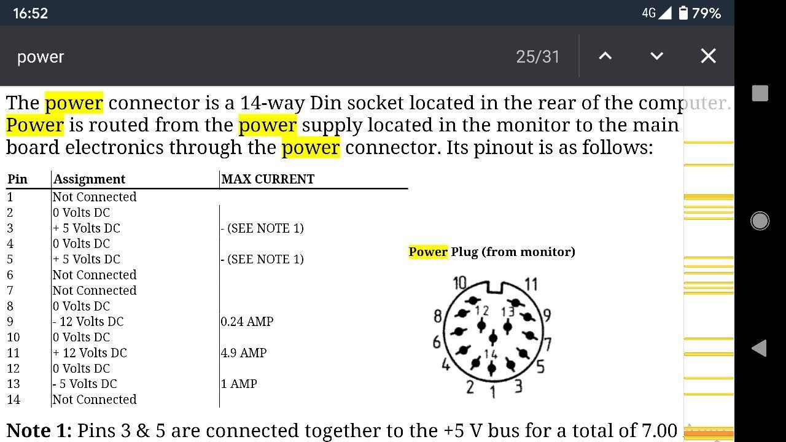
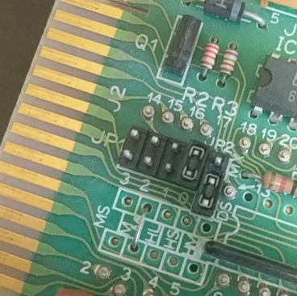
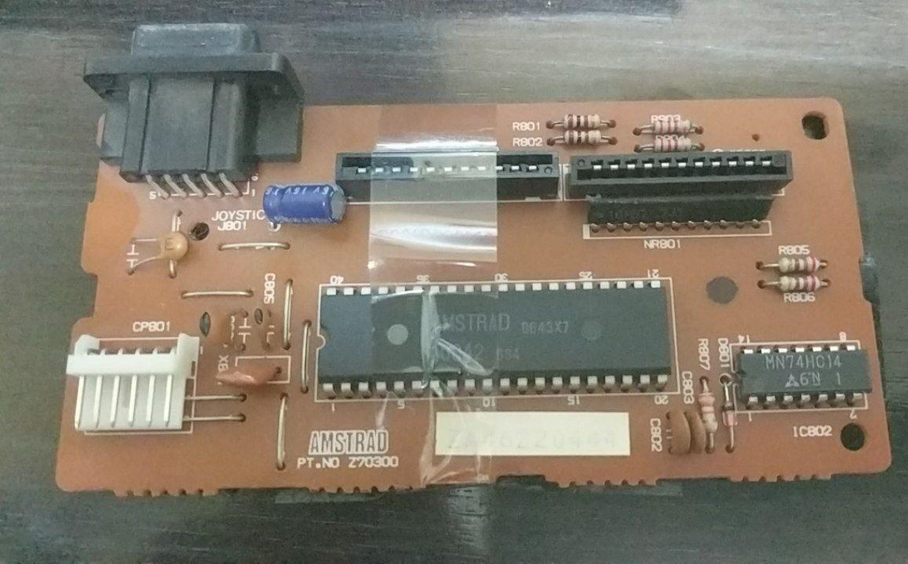
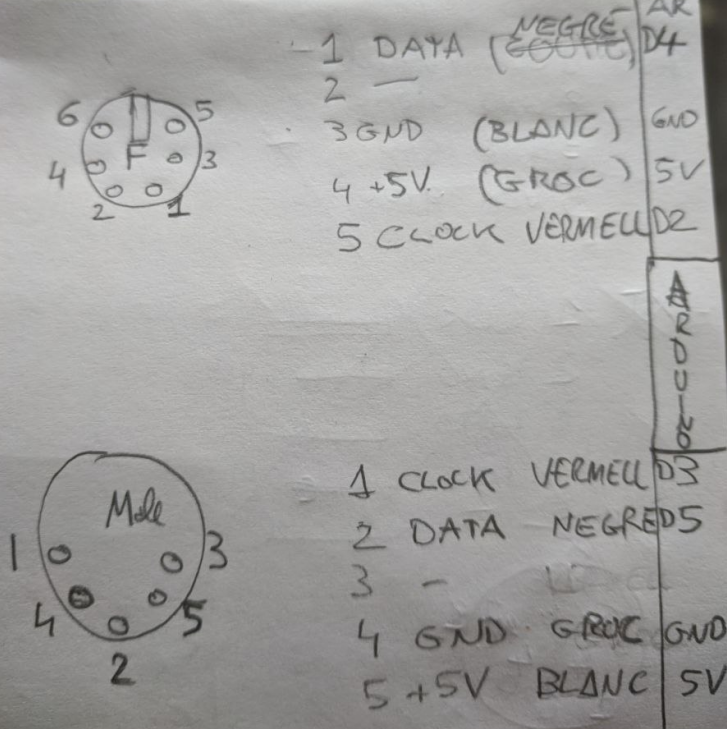
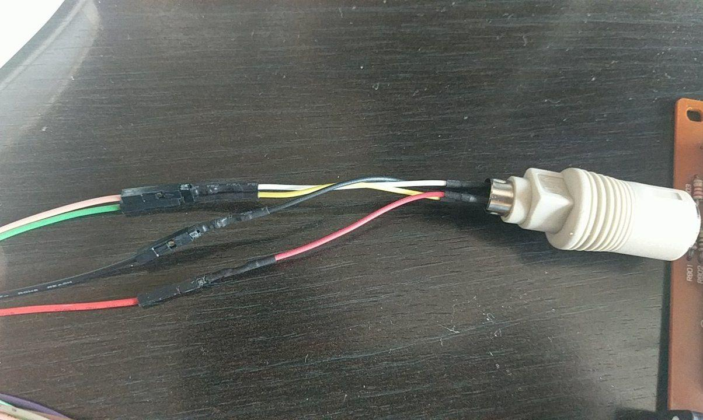
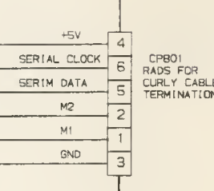
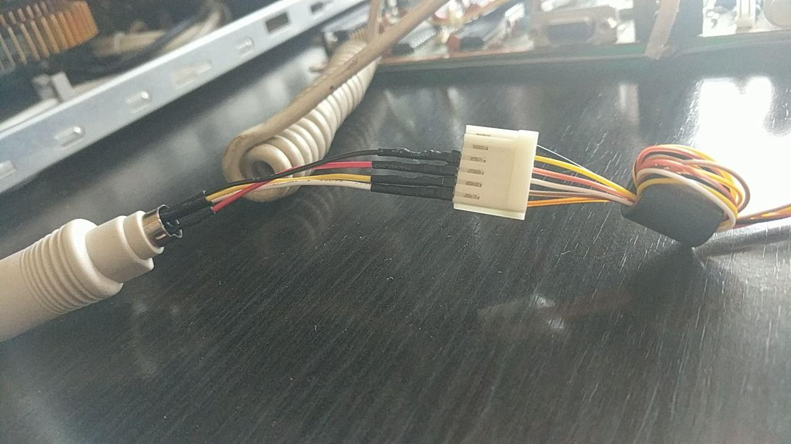
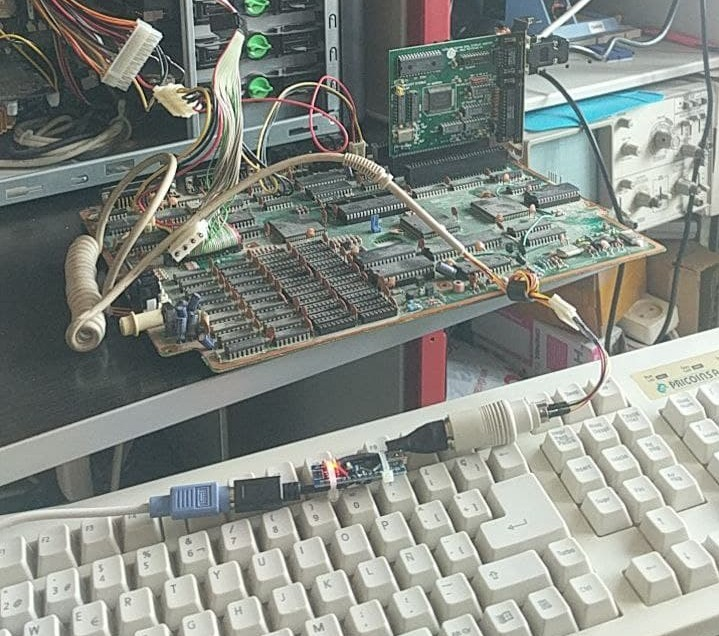
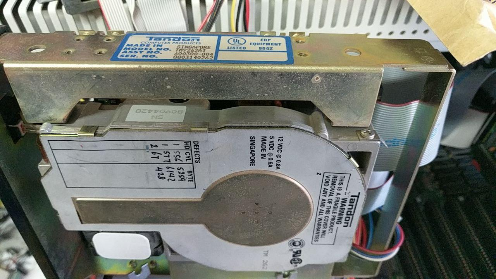
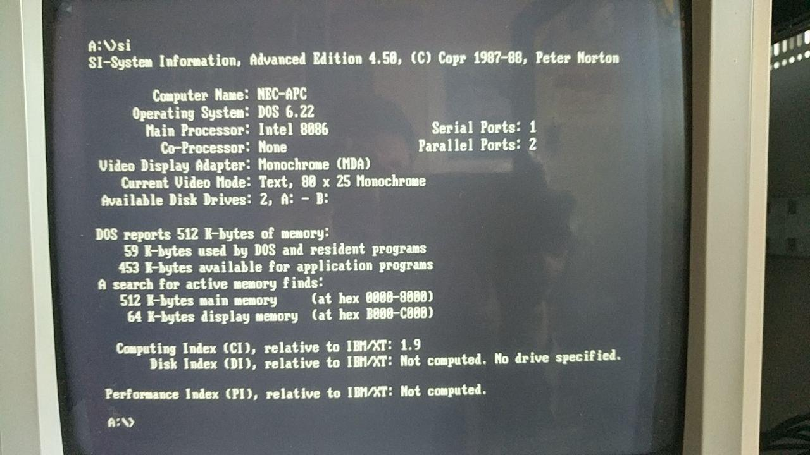

# AMSTRAD PC1512

## Background

Many years ago I found parts of an Amstrad PC1512 which I preserved and just recently I decided to try to make it work. 

The original Amstrad parts I have are:

* PC1512 motherboard
* Keyboard controller (not the full keyboard, just the circuit board inside it) and keyboard cable without connector
* Floppy drive 5.25"
* Tandon Hard Disk 20 MB

Follows my personal notes regarding the assembly and testing of my Amstrad PC1512 parts.

## Links of reference

* Documentation https://www.seasip.info/AmstradXT/1512tech/index.html
*  Service manual with schematics http://www.retroisle.com/amstrad/pcs/OriginalDocs/Amstrad_PC1512_PC-MM_PC-CM_Service_Manual_300dpi_Agujereado.pdf 

* Amstrad PC1512 Liberation Part 1 - Building An External Power Supply 
  https://ctrl-alt-rees.com/2018-09-10-amstrad-pc1512-building-an-external-power-supply.html

## Power Supply (on CP105 connector)

I used an ATX 400W power supply. To switch it on, I short green cable to GND on ATX 24 pin connector.

Power supply motherboard through CP105 4 pin connector (5V red, GND, GND, 12V yellow) (next to first ISA slot).

Take those 5V and 12V directly from ATX 24 pin connector to avoid having problems of high current loads that makes the board not booting sometimes.

Best method though is building an External Power Supply 
https://ctrl-alt-rees.com/2018-09-10-amstrad-pc1512-building-an-external-power-supply.html

Buy 14 pin DIN Male Plug Connector for Amstrad & Atari Systems: 
https://coolnovelties.co.uk/coolnovelties/connectors/291-14-pin-din-male-plug-connector-for-amstrad-atari-systems.html

## Video

Plugged an Hercules monochrome video card in any of the 3 free 8 bit slots.

I also plugged a 16 bit VGA video card.

## Floppy Drive

Plugged original Amstrad PC1512 5.25 floppy drive with jumper pin J1 set to 0.

This floppy drive also works on compatible XT computers but needs jumper J1 set to position 1. 

Power the floppy drive directly from a 4 pin connector from the ATX power supply.

## Keyboard

Standard XT keyboards do not work. Just works with AMSTRAD PC1512/1640 keyboards.

Amstrad Protocol Information:

* <https://www.seasip.info/AmstradXT/pc1512kbd.html>
* <http://www.kbdbabel.org/signaling/index.html>

PS/2 to XT keyboard converter:  <https://github.com/kesrut/pcxtkbd>

**Arduino based protocol converter from PS2 to PC1512:**   see parent folder 

Amstrad keyboard controller (keyboard matrix X/Y should be connected to CP802/3 connectors):

These are the connections when I tested converter signals with a Logic analyzer (Pink wire = Clock, Green wire = Data, Red wire = 5V, Black wire = GND):

These are the pin descriptions for original Amstrad keyboard controller:

And these are the final connections from Adapter to the motherboard (p3 GND, p4 5V, p5 Clock, p6 Data):

## Tandon Hard Disk (not working)

https://stason.org/TULARC/pc/hard-drives-hdd/tandon/TM262-21MB-5-25-HH-MFM-ST506.html

## Norton SI

