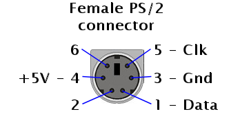
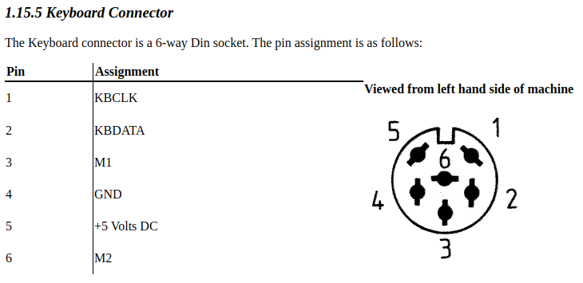
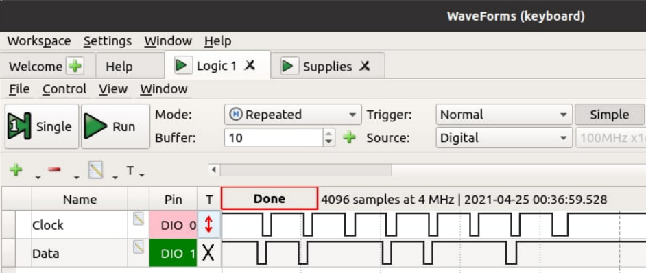
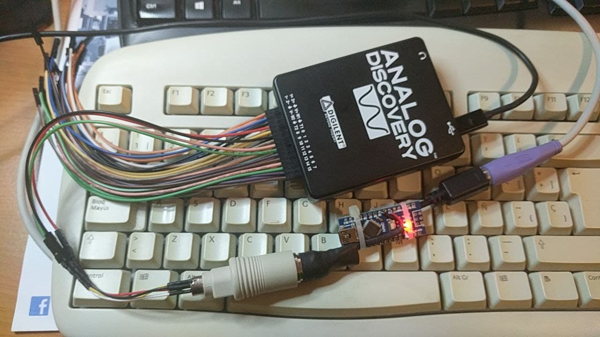

# PS/2 TO AMSTRAD PC1512 KEYBOARD PROTOCOL CONVERTER

This is an Arduino board based project to convert PS2 keyboard protocol to Amstrad PC1512 protocol. Amstrad had its own keyboard protocols different from the IBM PC XT one. 

Code is based and adapted from PS/2 to XT keyboard converter  <https://github.com/kesrut/pcxtkbd>

Please add https://github.com/techpaul/PS2KeyAdvanced Arduino library to compile.

I used an Arduino nano (5V) board. Any other Arduino based board can be uses as far as it has 5 V logic levels as keyboard power supply and signals work at 5 V.

More information and schematic I based my project can be found here http://www.ccgcpu.com/2019/02/14/the-xt-part-4-adapting-a-modernish-keyboard/ where describes the XT converter but is equally valid for our PC1512 converter.   **Please be careful** as I IMHO the schematics shown in this article are not quite clear, as I end up connecting power in the wrong way, so as a result one Arduino nano was fried and  the PS2 keyboard is broken.

I first built an PS2 Din-6 female to DIN-5 male XT protocol converter. As I fried my second Nano board, I decided to use the same converter and make it compatible also with the PC1512 using another adapter to extract the signals. As I did not have the 6-way Din Amstrad PC1512 keyboard connector I ended up soldering the keyboard wires directly to the motherboard.

### Schematic and pinouts

**SCHEMATIC WORK IN PROGRESS.**

Pins M1 and M2 are not used.

### Bill of materials

* Arduino Nano 5V
* DIN5 Male to Mini DIN6 PS/2 Female keyboard adapter cable **
* Wires and thermo-retractil shrinking tubing 

### Protocol adaptation

In order to adapt the protocol I found the following documentation regarding the PC1512 protocol:

* Amstrad PC1512 protocol <https://www.seasip.info/AmstradXT/pc1512kbd.html>
* Keyboard signals timing graph <http://www.kbdbabel.org/signaling/index.html>

These are the signals graphs when the key "k" is pressed: 

When I had the XT protocol converter running well, I adapted the Arduino code to look like the PC1512 graph with the help of a logic analyzer.

**Final assembly of the adapter (pictured attached to the logic analyzer):**

