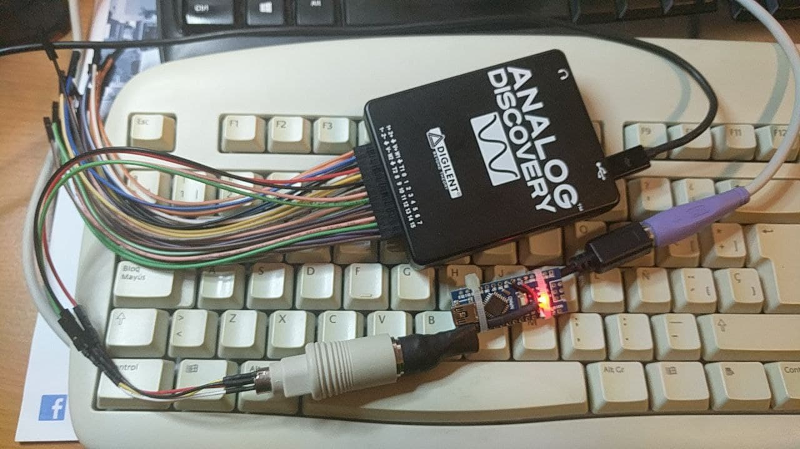

# PS/2 TO AMSTRAD PC1512 KEYBOARD PROTOCOL CONVERTER

This is an Arduino project to convert PS2 keyboard protocol to Amstrad PC1512 protocol. Amstrad had its own keyboard protocols different from the IBM PC XT one. 

Code is based and adapted from PS/2 to XT keyboard converter  <https://github.com/kesrut/pcxtkbd>

In order to adapt the protocol I found the following documentation:

* Amstrad PC1512 protocol <https://www.seasip.info/AmstradXT/pc1512kbd.html>

* Keyboard signals timing graph <http://www.kbdbabel.org/signaling/index.html>

  

Please add https://github.com/techpaul/PS2KeyAdvanced Arduino library to compile.

I used an Arduino nano (5V) board. Any other Arduino based board can be uses as far as it has 5V logic level as keyboard power supply and signals work at 5 V.

More information can be found here http://www.ccgcpu.com/2019/02/14/the-xt-part-4-adapting-a-modernish-keyboard/.   **Please be careful** as I IMHO the schematics are not quite clear, as I accidentally connected power in the wrong way and the Arduino nano  was fried and  the ps2 keyboard stopped working.

**ARDUINO SCHEMATIC TO BE UPDATED.**

Final assembly of the adapter (pictured attached to a logic analyzer):

